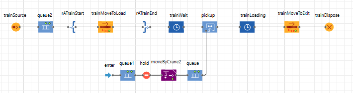

# IDS6145 (SimTech 2022) - FINAL PROJECT
The learning goal of this project is to understand how to use modeling and simulation in practice to solve a real problem. We hope you tie your work in from the previous assignments into one coherent model and simulation with a writeup that blends what you have learned.

> * Group participants names: Bryan Camacho (CamachoBry), Fred Martin (fmjr8), Max Stolarekno (mstolarenko)
> * Project Title: Efficient Logistics Win Wars 

The following repository is a reuploud of a final project for one of my Modeling and Simulation graduate courses for the University of Central Florida. This assignment was a collaborative effort between me and two other students. This submission was reuploaded due to none of us having access to making the original repository public.

**Abstract** 
The world is a dangerous place and the threat of a Chinese invasion of Taiwan is not making it safer. An aspect that has been identified as critical to the success of a potential invasion of Taiwan is the island's major port facilities (Easton, 2021, p. 8). This project models three different ports using AnyLogic software to identify port characteristics which lead to increased port efficiency. The goal of this study is to aid in the enhancement of knowledge which supports the development of a list which ranks Taiwanese ports from most efficient to least efficient based off of general port characteristics. The guiding logic is that more efficient ports will be of a higher priority to the Chinese military if planning/executing an invasion. Once identified, the Taiwanese government and its allies can better understand how to best prioritize ports in terms of resource allocation. Additionally, they will gain a better understanding of the overall time they will have to respond before China deploys enough forces to ensure the island's capture. The primary metric this study uses to determine overall port efficiency is a port's overall throughput capacity in a set period of time; if military equipment accumulates at a port, it becomes an easy target for an attacking adversary. This study finds that ports which include a high number and adequate ratio of berths, cranes, and trucks, with organized road networks, multiple port exits, and the ability to support a multi-line approach regarding cargo/material management best support port efficiencies. In the case of a potential Chinese invasion of Taiwan, it seems efficient logistics could make the difference. 

[Military Port Operations (Organized) [Flikr: https://www.flickr.com/photos/ironbrigade/32383389022/in/photostream/]] 
 [Port Operations (Un-Organized) [ShipLilly: https://www.shiplilly.com/blog/shocking-photos-west-coast-port-congestion-la-long-beach/]] 

## Introduction 

One could easily argue the world is on the brink of World War III given the current state of events in the Ukraine and recent actions/events which suggest China is preparing for an invasion of Taiwan to conquer the island (Haltiwanger, 2022). However, assuming the Ukraine conflict does not escalate, having an in-depth understanding of which type of ports function most efficiently could potentially aid the Western world in disrupting a Chinese invasion of Taiwan and limiting future loss of life. A military invasion by China would likely result in military support being sent to Taiwan by the Western world including the United States (U.S.) (Easton, 2021, p. 5). This support could be in the form of material or the actual execution of military operations in support of the defense of Taiwan. As U.S. citizens we are extremely interested in how the tensions between China and Taiwan unfold. These tensions could affect us personally and professionally. Left uncontested, a Chinese invasion of Taiwan could result in an extreme loss of life if the Western world chooses to fight for the island's freedom. As a frame of reference, although it never occurred, the U.S.' plan for a land invasion of Japan during World War II "called for a US force of 2.5 million" (Correll, 2009). An invasion of that magnitude would have undoubtedly led to a tremendous loss of life. 

The Western world can disrupt an invasion most effectively if it knows how much time it likely has to respond once the invasion begins. This time appears to be directly related to the use of ports. Understanding ports in this case matters because the seizure and use of Taiwan’s “large port facilities” is viewed as essential by Chinese doctrine due to the small size and vulnerability of the island’s “beaches and coastal airports” (Easton, 2021, p. 8). Thus by studying the characteristics of various ports, and how these characteristics impact port efficiency, our models and simulations can begin to provide insights about which of Taiwan's ports may be the most supportive of a Chinese invasion. Once understood these insights could be applied or generalized to Taiwanese ports allowing Taiwan and its allies to gain an understanding of how much time they would have to respond before a Chinese force is deployed that will ensure the island's capitulation. Additionally, this enhanced understanding of port efficiencies will enable Taiwan to better allocate resources to its various ports. Lastly, if time allows, Taiwanese ports could be modeled and simulated to enhance this base of knowledge. 

This project can be viewed as a foundation for future research concerning which of Taiwan's ports, or combinations of ports, would best support a Chinese invasion, and the time this invasion would take if using these ports. To be successful, it is estimated China will need to transport between 300,000 and 2.25 million soldiers to Taiwan to achieve a military victory depending on the situation (Easton, 2021, pp. 5-6). An invasion of this scale would undoubtedly take time and a tremendous amount of logistical resources. It is worth noting the “grandest amphibious operations” in history, D-Day and Okinawa, would be dwarfed in size and complexity by an amphibious invasion of Taiwan (Easton, 2021, p. 4). On the first day of the D-Day landings, amphibious invasion forces delivered over 150,000 Allied soldiers ashore (History.com Editors, 2019). 

This project examines three ports which are abstractions of real-world locations (Miami, Taichung, Jacksonville). To understand which port characteristics are most efficient, we analyze multiple factors from the perspective of cargo/material. We analyze the total amount of cargo to move through the system in a specific amount of time, how long it takes for material to be picked up once initially downloaded from a ship (queue mean time), how much material sits together once downloaded (queue mean size), the average time a train sits at the loading station before departing with a full load (queue mean time), and the total amount of trains which are able to depart the port loaded with material. In future iterations of this model/simulation, this material can be refined into military equipment. Once refined, a better understanding of which ports would best support a Chinese invasion can be determined as well as an approximation of how long it would take China to deploy the equipment needed to conquer Taiwan. 

**Problem Statement** 
To effectively respond to a Chinese invasion of Taiwan, the Western world would likely benefit from having an understanding of the time required by China to complete the invasion. As previously mentioned, Taiwan's major ports would be required to successfully execute the invasion operation due to the large amount resources required to accomplish the mission. So, by examining characteristics which contribute to the efficiency of port operations, our models/simulations contribute to the development of an invasion timeline. The results of this project, a more refined understanding of which port characteristics enhance port operations most, can be applied to determine which Taiwanese ports are likely the most efficient thus making them a possible target of the Chinese government. Once the 'most' efficient ports are determined, more variables can be introduced to the model to approximate a more accurate timeline.

The primary problem facing the Chinese military is the time required to unload the troops needed to be successful. On a basic level, this problem is a throughput issue. It does not matter if the entire 2 million soldier force can fit on a single armada of ships because only so many of those ships can be unloaded at a single time. The number of ships which can be unloaded in a period of time depends on the port's capacity. The more time it takes to transport and unload the force, the more time the U.S. and other Western nations have to respond to the invasion.

This model will support its users, Taiwanese and Western nation senior leaders, by supporting the development of a planning factor concerning the amount of time they will have to respond in the event of a Chinese invasion of Taiwan. This model will highlight throughput as a port related problem by directly examining which port characteristics enhance port efficiency, and indirectly provide information on how different methods of disrupting port operations could increase the time required to unload an invasion force.

**Motivation** 
This topic is important because a successful and uncontested invasion of Taiwan could easily escalate to World War III. Of course there is no way to predict the future, but perhaps a quick and prompt response by Taiwan and the West could lessen the loss of life and prevent an invasion from turning into World War III. As previously suggested, a fight over Taiwan between China and Taiwan and its Western allies would lead to many casualties, but World War III would lead to many more. By gaining an understanding of how long it would take China to invade Taiwan, the Taiwanese government and the Western world could draft better plans which enable effective deterrence and countermeasures. 

**Proposed Solution** 
Our proposed process to begin tackling this problem is through a hybrid multi-paradigm model which is a combination of agent-based modeling and discrete-event modeling logic. As previously mentioned, we will evaluate the efficiency of several port designs primarily from the perspective of cargo/material. More specifically, we analyze how much raw material can be pushed through the port in a certain amount of time, how long cargo/material sits before moving once unloaded from a ship (queue mean time), how many pieces of material sit together once downloaded (queue size), the average time a train sits at the loading station before departing with a full load (queue mean time), and how many trains depart the port after being fully loaded.  

**Contributions**  
1. This project contributes to the problem outlined above by observing the threat of a Chinese invasion of Taiwan through a lens shaped by port efficiency. 
2. This project evaluates port efficiency primarily from the perspective of cargo/material. It stands to reason that if vast amounts of military equipment get 'bottled up' at a port of entry it is easier for it to be destroyed. 
3. The outputs of this project could influence the prioritization given to ports in terms of resources allocated by the Taiwanese government and its allies. 

## Background 

The governments of Taiwan and China have both simulated different aspects of the invasion using different means (Associated Press, 2015; Benjamin, 2021; Feng, 2021; Hagstrom, 2022). Taiwan appears to conduct a computer-assisted simulated exercise annually focused on the invasion (Feng, 2021). Prior to the exercise, which was set to occur in April 2021, the Taiwanese Defense Minister stated forces would need to "fight an invasion fleet for as many days as it took" (Feng, 2021, para. 8). This statement suggests a more accurate time estimate would be desirable. A computer-assisted simulation supported exercise conducted in 2015 estimated that Taiwan would win the war, but it would take approximately two weeks after Chinese ground forces landed on the western shores of the island (Associated Press, 2015). According to Easton (2021), the west coast of Taiwan has limited and exposed landing sites suggesting a land force large enough to ensure the island's capture could not be completed in a two week period (p. 8). Again, it seems a model/simulation focused on the time it would take for a Chinese force to be deployed would be desirable. For what it is worth, the 2015 exercise did not include the U.S. participating in combat operations (Associated Press, 2015). 

The method of simulation employed by the Chinese government is not clear (Benjamin, 2021; Hagstrom, 2022). It seems likely they would use some form of computer-assisted simulation supported exercise to wargame the invasion, but, at a quick glance, literature supporting this claim seems to be limited. However, China does appear to conduct live simulated training events focused on Taiwan (Benjamin, 2021; Hagstrom, 2022). For example, satellite imagery suggests the Chinese military has trained on buildings which model the Taiwanese President's office facilities in the capital city of Taipei (Benjamin, 2021). 

A quick review of on-line sources suggest this project would contribute to the body of knowledge surrounding an invasion of Taiwan.

## Methodology 

#### Model 
Our models capture all relevant features such as ships, trucks, cranes and trains which relate to the throughput problem at hand. All elements above are key features which are dependent on the timing of each other to release and move materials across the port process. **Our hypothesis is that due to the scale of supporting infrastructure, to include the number of berths and cranes, Port A (Miami model) will be the most efficient and provide the highest throughput of cargo/material in a given span of time.** 

The general process we followed in our models are shown via the behavioral diagram below:

 

1) Ships arrive and move to designated Dock/Berth if open.
2) The Dock/Berth seizes a Truck (transporter) to call for unloading.
3) The Truck is then called over to the Destination Node where it will be loaded with a container.
4) The Crane is then called and unloads a container from the Ship to the Truck which is waiting at node.
5) Once the Truck is loaded, it heads to the Storage yard to store the containers in a specified Storage.
6) A second class of Truck is then called to retrieve the stored containers and head to the Train.
7) Once the Truck arrives to the Train, a Crane unloads the container from the Truck to the Train until Train reaches 12 containers and leaves the station.

#### Apparatus 
###### Berth/Ship/Container Logic 
 
Each berth has a sequence of logic blocks as follows:
- Source block to control the arrival of ships using interarrival.
- MoveTo block surrounded by RestrictedStart/End blocks to direct ships to Port and only allow one ship at Berth at a time.
- Split block to mimic the action of the Ship having containers which is split into two logic sequences: one for the ship and one for the containers.
- For Ship: a Delay block to mimic unloading and a MoveTo block to move Ship to exit.
- For containers: a seizeTransporter block to call a Loading Truck, a moveByCrane block to move the container from Ship to Loading Truck, store block to have the Loading Truck store the container in the container yard. Followed by a retrieve block which will seize a Train Truck which removes a container from the container yard and takes it to Train.
- An exit block leaving the Container logic sequence which is fed into the Train logic sequence. 

###### Train Logic 
 

The Train logic:
- Train Source block to control the arrival of the train.
- MoveTo block surrounded by RestrictedStart/End blocks to direct Train to Load point and only allow one Train at the Load point at a time.
- Enter block is used to direct the Train Trucks from the previous Ship logic to the Train logic.
- Following the enter block, there is a queue to avoid the Train Trucks from going to the Load point all at once, then moveByCrane block to unload the container from the Truck to the Train.
- Both logic sequences are then merged by a pickup block which adds the containers to the Train.
- Delay block then follows after pickup.
- Train MoveToExit block to make the train go to exit node and ending with a trainDispose block.

#### Independent/Dependent Variables/measures 
**Variables and Data:** 

**Dependent Variable:** Amount of cargo/material to be processed by a port once unloaded from ship in 1hr of simulation time. (This limit is imposed by the version of AnyLogic we are using.)

**Independent Variables:** 

- Number of Berths 
- Number of Trucks 
- Efficiency of Road Networks 
- Number of Trains 
- Number of Cranes 
- Queue sytles (i.e. Target vs. Kohl's Style) 
- Type of Cranes (i.e. overhead crane with single or multiple bridges) 
- Truck, Crane, and Train Speeds 
- Port Exit Points 
*The list above is not exhaustive. 

Data will be derived from port-models created to replicate the ports of Miami, Taichung, and Jacksonville. These models are **not** high fidelity models of these real-world locations. 

#### Parameters for Simulation 
- **The number of cranes, trains, berths, and trucks will be unique to each modeled port.** 
- Simulation outputs will be compared after running for 1hr of simulation time. 
- Trains will depart the port once they are loaded with 12 pieces of cargo/material. 

- Data will be derived from ports using single-line (Kohl's style), multi-line (Target style), or a combination of each  queuing style. 

#### Simulation Procedure 
The three modeled ports, in general, share the same AnyLogic models or chains of logic blocks except for minor differences. Each project participant provided two port models which implement a different queuing style for the trucks which pick-up cargo/material from the ships and move it to the container yard. 

Data is collected by reviewing the counters associated with certain logic blocks, such as the trainDispose blocks, and charts generated by AnyLogic which measure queue mean times and queue lengths. 

Each project participant will run each of their port models at least once and report and analyze their model's generated data. Generated data will be reviewed by each participant on an 'internal' level which compares both variants of their port models. Then each participant's more efficient port variant will be compared on an 'external' level against the other project participants' models to determine whose port model variant is the most efficient overall. 

## Results  

##### PORT A 
Queue Length and Wait Time of Materials (Multi-Line vs Single-Line)
 

Train Time at Station Distribution (Multi-Line vs Single-Line)
 

### Total Trains Throughput: 4 Trains
### Total Cargo/Material Throughput: 48 Pieces

[**Link to AnyLogic Single-Line and Multi-Line Queue Variant Files**](https://github.com/IDS6145-Fall2022/final_project-silver/tree/main/AnyLogic%20Files/Port%20A%20-%20Bryan) 

[**Link to Single-Line Queue Variant Video**](Images/singleline.mov) - **Link to video on GitHub, click "View raw" to open.** 

[**Link to Multi-Line Queue Variant Video**](Images/multiline.mov) - **Link to video on GitHub, click "View raw" to open.** 

#### PORT B 

[**Link to AnyLogic File - All Single-Line (Kohl's Style) Queues**](https://github.com/IDS6145-Fall2022/final_project-silver/blob/2fb317a4ff3964d08041a1e27aee7b04693e9056/AnyLogic%20Files/Port%20B%20-%20Fred/Silver_Group_Project_Fred_Martin_All_Kohls_02DEC22/Silver_Group_Project_Fred_Martin_All_Kohls_02DEC22.alp) - Filename "Silver_Group_Project_Fred_Martin_All_Kohls_02DEC22" 

[**Link to All Single-Line Queues (Kohl's Style) Video**](Images/SimTech_Fred_Martin_All_Kohls.mp4) - **Link to video on GitHub, click "View raw" to open.** 

 

[**Link to AnyLogic File - Half Single-Line (Kohl's Style) and Half Multi-Line (Target Style) Queues**](https://github.com/IDS6145-Fall2022/final_project-silver/blob/2fb317a4ff3964d08041a1e27aee7b04693e9056/AnyLogic%20Files/Port%20B%20-%20Fred/Silver_Group_Project_Fred_Martin_Half_Kohls_Target_02DEC22/Silver_Group_Project_Fred_Martin_Half_Kohls_Target_02DEC22.alp) - Filename "Silver_Group_Project_Fred_Martin_Half_Kohls_Target_02DEC22" 

[**Link to Half Single-Line (Kohl's Style) and Half Multi-Line (Target Style) Queues Video**](Images/SimTech_Fred_Martin_Half_Kohls_Half_Target.mp4) - **Link to video on GitHub, click "View raw" to open.** 

#### PORT C 

 

### Total Trains Throughput for the Multi-Line Queue System: 2 Trains
#### Total Cargo Throughput for the Multi-Line Queue System: 24 Containers
### Total Trains Throughput for the SIngle-Line Queue System: 1 Train
#### Total Cargo Throughput for the SIngle-Line Queue System: 12 Containers

[Link to AnyLogic source files for the Multi-Line and Single-Line Queue Systems](https://github.com/IDS6145-Fall2022/final_project-silver/tree/main/AnyLogic%20Files/Port%20C%20-%20Max) 

[Link to Video Demonstration of Multi-Line Queue System](https://github.com/IDS6145-Fall2022/final_project-silver/blob/main/Images/Maxwell_Stolarenko_MulitLine_Video.mp4) - click "View raw" to download and open the video through GitHub. [YouTube Mirror](https://youtu.be/99SEonmCcOY) 

[Link to Video Demonstration of Single-Line Queue System](https://github.com/IDS6145-Fall2022/final_project-silver/blob/main/Images/Maxwell_Stolarenko_SingleLine_Video.mp4) - click "View raw" to download and open the video through GitHub. [YouTube Mirror](https://youtu.be/Nl8ng5gwYrc) 

## Discussion 
Once each model was ran multiple times, each port (A, B, C) presented unique insights:
- **Port A** showed a behavior in the Loading/Unloading Trucks (transporters) that caused the path-guided trucks to become grid-locked with other trucks and stop all throughput of material. The issue was solved by lowering the number of trucks used for loading/unloading causing an increase in throughput. It was learned that less trucks diminishes traffic and need for traffic control which increases the amount of containers going through the port. 
- **Port B** demonstrated two points which I believe can be critical to a port's efficiency. First, a work truck's routes can limit port efficiency. The truck route from my Hazardous ship berth (most northeastern berth) to the storage yard appears to be slightly shorter than the same routes supporting the other berths. This shorter distance had a noticeable impact on the time cargo/material 'sat' at the berth. This finding suggests military analysts evaluating Chinese/Taiwan tensions should study this feature of ports to help determine efficiency. Next, the amount of port exits, points where cargo/material can exit the port area, can significantly impact a port's overall throughput. By comparing my two port variants alone, the 'All Kohl's' variant with four exits enabled 36 more pieces of cargo/material to depart the port compared to my mixed queue variant with only three exits in the same amount of time. This seems as though it could become a crucial characteristic when determining a port's efficiency if the cargo/material is at risk of an enemy attack; quicker dispersion of cargo/material could ensure its survivability longer. 
- **Port C** faced a problem where facility operations efficiency was weak due to the scale/size of its property and the distance between key locations. Ground transporters struggled to keep up with incoming ships because of the sheer distance between their home location, the docking region, and where they needed to store their containers. This problem was initially addressed by introducing additional ground transporters into the system at a different initial location, which did noticeably increase the number of containers in movement at any given moment. As such, arguments can be made that having too few trucks in the system had poor efficiency from the lack of manpower to offset the scale of the facility. Convserse, it was also observed that having too many trucks in the system generated poor efficiency as well due to the sudden increased frequency in backed up queue lanes. Determining the fair middle ground between too many trucks and too few trucks is essential to operations efficiency. 

## Conclusion 

**Port A** 
Following the metrics of interest, Port A using single-line queue operation showed an average Queue Waiting Time of 958.62 time units and average container queue length of 227.38 cargo/materal units while the multi-line queue operation variant showed an average Queue Waiting Time of 240.11 time units and average queue length of 6.41 cargo/materal units. As for the average Train Time at Station, the average for multi-line variant is 822.73 time units while the average for single-line variant is 814.68 time units. 

**Port B** 
A close examination of Port B variants reveals the single-line only variant is more efficient than the single/multi-line (mixed) variant in terms of overall throughput (144 pieces of cargo/material vs. 108 pieces). The single/Kohl's variant produced an average queue length at each berth of ~28.2 cargo/material units and an average queue wait time at each berth of ~942.8 time units for cargo/material units. The average wait time for a train supporting this variant to be loaded was ~1,014.4 time units. The mixed/Kohl's-and-Target port variant produced an average queue length at each berth of ~43.9 cargo/material units and an average queue wait time at each berth of ~1051.8 time units for cargo/material units. The average wait time for a train supporting this variant to be loaded was ~1003.6 time units. Other than the average train loading time, the single/Kohl's port variant performed more efficiently. Although it seems the extra exit point enabled it to be the most efficient in terms of this study's leading metric (overall cargo/material throughput). 

**Port C** 
Port C looked at two different arrangement designs for its queues, namely adopting a single-line/multiple-servers design and a multipl-lines/multiple-servers design. The data provided from repeated runs of the single-line/multiple-server port simulation produced an average queue length to reach their container area of 1,678.58 time units and an average queue length of 197.05 cargo/material units. Conversely, the data from the multiple-lines/multiple-servers showed that, on average, queue waiting times to reach destinations was approximately 1,173.61 time units with an average queue length 35.66 cargo/material units. The average time to fully supply a train and depart varied between the two designs, with the single line system having an average of 2,801.65 time units for each train's wait time and the multi-line system having an average of 1,723.89 time units between departures. Contrast to the other two ports, Port C showed slightly higher efficiency with its multi-line queuing system. 

**Overall Conclusion** 
By comparing each of our ports with their respective port variants, it becomes clear that our hypothesis was not supported by the simulation generated evidence. We hypothesized that Port A (Miami model), due to the scale of supporting infrastructure, to include the number of berths and cranes, would be the most efficient and provide the highest throughput of cargo/material in a given span of time. However, although it was not the most efficient terms of time unit measurements, Port B (Taichung model) was the most efficient port in terms of cargo/material throughput in the given time span (144 pieces vs. 48 and 24 pieces). Although not initially identified as a measurement, by running our simulations it became apparent that Port B benefitted from having four port exits versus the other ports which only had one each. 

Port A's queue time and queue length averages, using the multi-line approach, were far superior to Port B's and C's (Jacksonville model). Port A's six berths, six cranes, and supporting truck fleet of ten supporting the berths and 20 supporting the trains enhanced the port's overall efficiency. Port A had six trucks supporting each berth and each train while Port C had 10 supporting the berths and 10 supporting the movement of cargo to trains. It seems Port A's multi-line approach combined with an organized road network and refined truck ratio, in terms of supporting berths and trains, led to enhanced proficiency overall except against the overall throughput metric. However, based on findings related to Port A and Port C, acknowledging Port C's efficiency was slowed due to physical distances, it seems if these ports were upgraded to include more port exits, they would likely become much more efficient than Port B regarding total cargo/material throughput. 

Based off of this initial report, we recommend the Taiwanese government and its allies prioritize resources to ports which have the highest ratio of berths, cranes, and trucks, supported by organized road networks and multiple port exits because these ports would likely be the most desirable to a Chinese invasion force. If multiple ports were found to be similar concerning these characteristics, the next discriminator to apply would be the ability of the ports to support a multi-line approach to cargo/material movement; a port which supports a multi-line approach should be prioritized over one that does not. Combined, the characteristics identified above would most likely facilitate an invasion via their combined ability to efficiently push cargo/material/military equipment out of isolated port areas increasing the survivability of the incoming cargo/material. As previously mentioned, consolidated and neatly organized cargo/material can become an easy target with a high payoff for an attacking adversary. Additionally, the characteristics identified in this report applied correctly should enable the development of a planning timeline concerning the overall time China would require to deploy a force large enough to conquer Taiwan. Lastly, if the Taiwanese government and its allies can apply the characteristics discussed in this study they will likely be able to identify the most efficient ports and provide them with the appropriate resources to potentially deter or prevent a Chinese invasion. If successful, these efforts might just make the world a slightly safer place. 

**Notable extensions to our model would include implementing:** 
- A ship schedule
- Material-specific berths and storage to capture a certain threshold of materials
- Model different ships/vessels
- Integrating time of response to disrupt material flow
- Weather impacts on ship, truck, and crane performance
- Crew experience/competence impacts
- More realistic Taiwanese port models

**Questions:** 
- How much cargo/material do typical shipping vessels actually unload at a port visit? How would realistic cargo shipments influence our models' outputs?
- How would unloading cargo and reloading ships impact our models' performance? For example, ships often download some of their cargo and receive more cargo when visiting a port (G. Rabadi, personal communication/in-class discussion, 16 November, 2022)?
- What sytle of trucks are used at large ports? Can they only move one container at a time?
- In the real-world, are different types of cranes more effient and effective than others? (For example, the jib crane vs. the overhead crane.)
- How does a well trained and experienced port work force influence operations versus a new and inexperinced port work force?

## References 
Assignment 1 - Introduction Material - Fred Martin 

Associated Press. (2015, January 13).Computer simulation has Taiwan beating China in war, Taiwanese military says. Fox News. https://www.foxnews.com/story/computer-simulation-has-taiwan-beating-china-in-war-taiwanese-military-says 

Benjamin, J. (2021, February 13). China’s alarming invasion simulations. The Hamilton Spectator. https://www.thespec.com/opinion/contributors/2021/02/13/chinas-alarming-invasion-simulations.html 

Correll, J. T. (2009, June 1). The invasion that didn’t happen. Air & Space Forces Magazine. https://www.airandspaceforces.com/article/0609invasion/ 

Easton, I. (2021, July 22). Hostile harbors: Taiwan’s ports and PLA invasion plans [Embedded Document]. Project 2049 Institute. https://project2049.net/2021/07/22/hostile-harbors-taiwans-ports-and-pla-invasion-plans/ 

Feng, J. (2021, April 20). Taiwan To begin 24/7 simulation of Chinese invasion. Newsweek. https://www.newsweek.com/taiwan-begin-24-7-simulation-chinese-invasion-1584984 

Hagstrom, A. (2022, September 1). China has repeatedly simulated attacks on US warships, Taiwan warns. Fox News. https://www.foxnews.com/world/china-repeatedly-simulated-attacks-us-warships-taiwan-warns 

Haltiwanger, J. (2022, August 4). China's missile launches and military drills around Taiwan following Pelosi's visit look like a rehearsal for seizing the island, China experts say. Insider. https://www.businessinsider.com/china-military-drills-around-taiwan-look-like-rehearsal-for-invasion-2022-8 

History.com Editors. (2019, June 5). D-Day. History. https://www.history.com/topics/world-war-ii/d-day 
